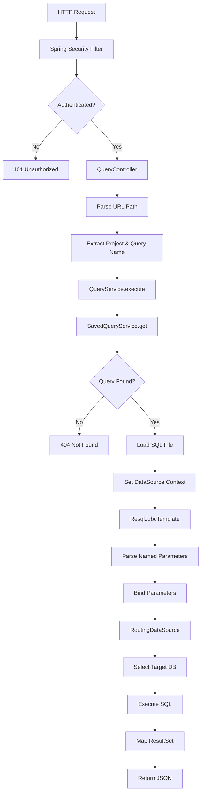
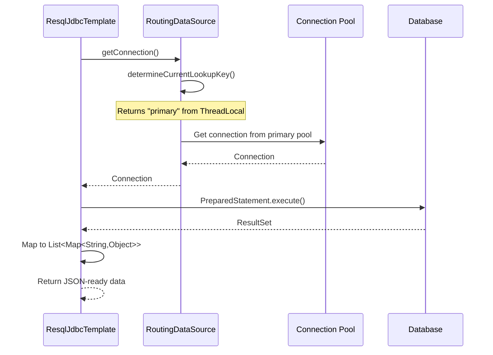
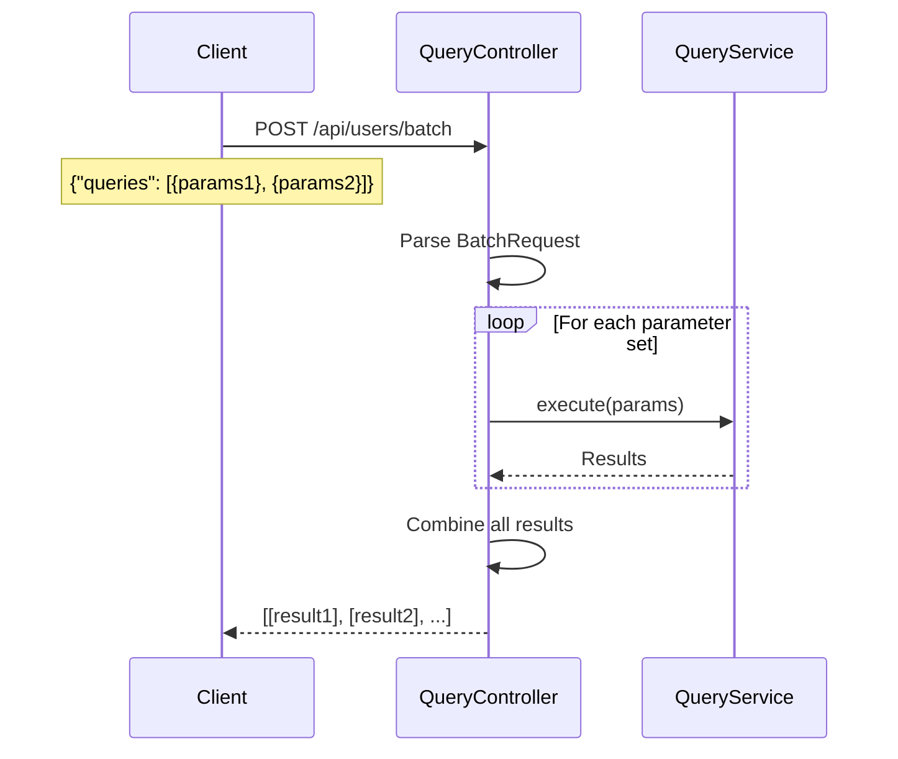
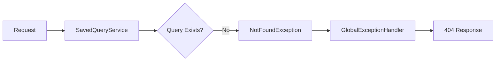
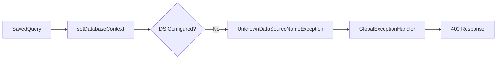
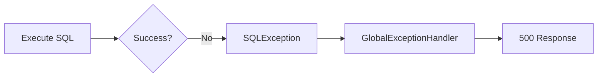

# Data Flow

This document describes how requests flow through the Resql system from HTTP request to database response.

## Request Flow Diagram



## Detailed Request Processing

### Phase 1: HTTP Request Reception

**Entry Point:** QueryController

```
POST /api/users/find-by-email
Headers:
  Content-Type: application/json
  Authorization: Basic xyz...
Body:
  {"email": "user@example.com"}
```

**Controller Actions:**
1. Spring MVC maps request to `QueryController.execute()`
2. Path variables extracted: `project = "api"`, path = `"/users/find-by-email"`
3. Request body deserialized to `Map<String, Object>`
4. URL pattern matched using regex

**Code Flow:**
```
QueryController.java:31
  ↓
urlPattern.matcher() extracts query name
  ↓
queryService.execute(project, "POST", name, parameters)
```

### Phase 2: Query Loading

**Service:** SavedQueryService

**Lookup Process:**
1. Construct file path: `{baseDir}/{project}/POST{queryName}.sql`
2. Check in-memory cache for SavedQuery
3. If not cached, load from filesystem
4. Parse query metadata (datasource name, SQL content)

**SavedQuery Structure:**
```java
record SavedQuery(
    String dataSourceName,  // Target database
    String query            // SQL with named parameters
)
```

**Example File:**
```sql
-- datasource: primary
SELECT id, name, email
FROM users
WHERE email = :email;
```

### Phase 3: DataSource Context Setup

**Component:** DataSourceContextHolder

**Process:**
1. Extract datasource name from SavedQuery
2. Validate datasource exists in configuration
3. Set ThreadLocal context for current request
4. RoutingDataSource uses this context to route connections

**Thread Context:**
```
Thread-123 → DataSourceContextHolder.set("primary")
  ↓
RoutingDataSource.determineCurrentLookupKey()
  ↓
Returns "primary"
  ↓
Connection from primary datasource pool
```

### Phase 4: Parameter Binding

**Component:** ResqlJdbcTemplate

**Named Parameter Processing:**

**Input SQL:**
```sql
SELECT * FROM users WHERE email = :email AND status = :status
```

**Input Parameters:**
```json
{
  "email": "user@example.com",
  "status": "active"
}
```

**Transformation:**
1. Parse SQL to find `:paramName` tokens
2. Replace with JDBC `?` placeholders
3. Build ordered parameter array
4. Create PreparedStatement

**Processed SQL:**
```sql
SELECT * FROM users WHERE email = ? AND status = ?
```

**Parameter Array:**
```java
["user@example.com", "active"]
```

### Phase 5: Query Execution

**Component:** RoutingDataSource → JDBC Driver

**Execution Flow:**



**Result Mapping:**

**Database ResultSet:**
```
id  | name      | email
----|-----------|------------------
101 | John Doe  | john@example.com
```

**Mapped to:**
```json
[
  {
    "id": 101,
    "name": "John Doe",
    "email": "john@example.com"
  }
]
```

### Phase 6: Response Serialization

**Component:** Spring MVC

**Process:**
1. QueryController returns `List<Map<String, Object>>`
2. Spring's Jackson converter serializes to JSON
3. HTTP response headers set automatically
4. Response sent to client

**HTTP Response:**
```
HTTP/1.1 200 OK
Content-Type: application/json

[
  {
    "id": 101,
    "name": "John Doe",
    "email": "john@example.com"
  }
]
```

## Batch Request Flow

**Endpoint:** `POST /{project}/{query}/batch`



**Input:**
```json
{
  "queries": [
    {"email": "user1@example.com"},
    {"email": "user2@example.com"}
  ]
}
```

**Output:**
```json
[
  [{"id": 101, "name": "User One"}],
  [{"id": 102, "name": "User Two"}]
]
```

## Error Flow

### Query Not Found



### Invalid DataSource



### SQL Execution Error



## Performance Optimizations

### 1. Query Caching
- SQL files loaded once at startup
- No file I/O on request path
- Reload only in development mode

### 2. Connection Pooling
- Pre-warmed connection pools
- Reuse connections across requests
- Configurable pool sizes

### 3. Thread-Local Context
- No synchronization overhead
- Fast context switching
- Isolated per request

### 4. Direct ResultSet Mapping
- Stream-based processing
- No intermediate objects
- Memory-efficient for large results

## Tracing and Observability

### OpenTelemetry Integration

Each request automatically creates spans:

```
HTTP POST /api/users/find-by-email
├─ QueryController.execute
├─ QueryService.execute
│  ├─ SavedQueryService.get
│  └─ ResqlJdbcTemplate.queryOrExecute
│     └─ SQL: SELECT * FROM users...
└─ Response Serialization
```

### Log Correlation

All logs include:
- Request ID
- Query name
- DataSource name
- Execution time
- Parameter count

**Example Log:**
```
INFO [req-123] QueryService - Incoming POST for api::users/find-by-email
DEBUG [req-123] ResqlJdbcTemplate - Executing query with 1 parameters
INFO [req-123] QueryService - Query completed in 23ms
```

## Security Checkpoints

### 1. Authentication (Spring Security)
All requests pass through security filter chain.

### 2. Authorization (Future)
Fine-grained permissions per query/datasource.

### 3. SQL Injection Prevention
Only prepared statements with parameter binding.

### 4. Data Source Isolation
Each request isolated to configured datasources.

## Transaction Management

**Current Behavior:**
- Auto-commit mode
- Each query is atomic
- No multi-query transactions

**Future Enhancement:**
Explicit transaction support for batch operations.
