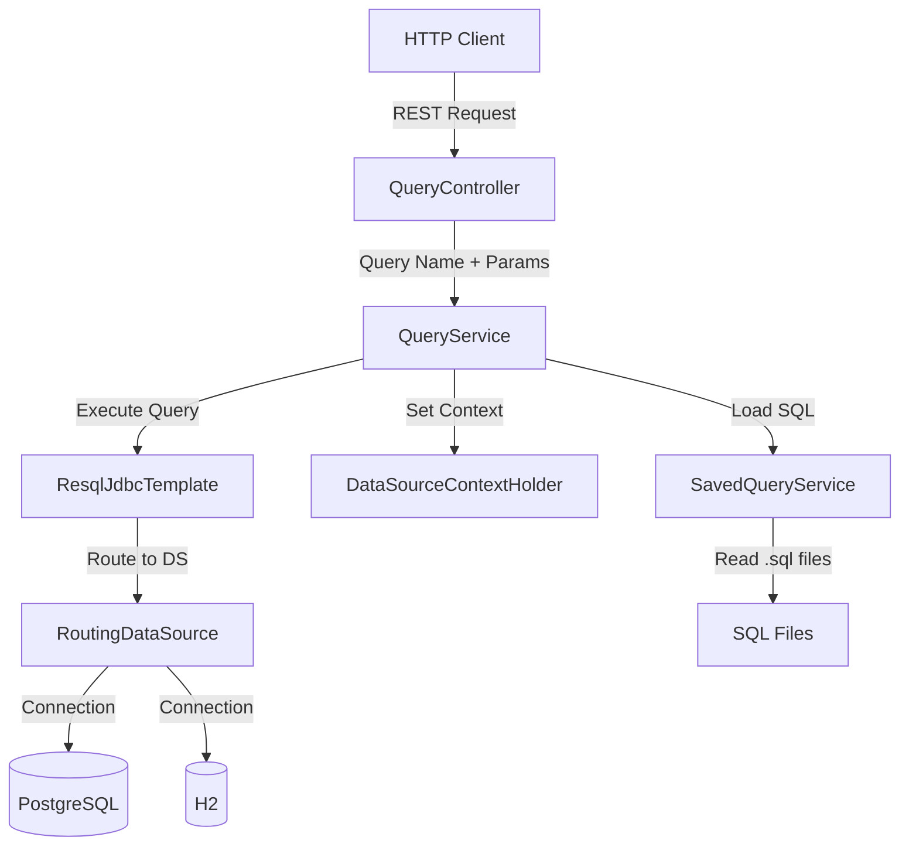
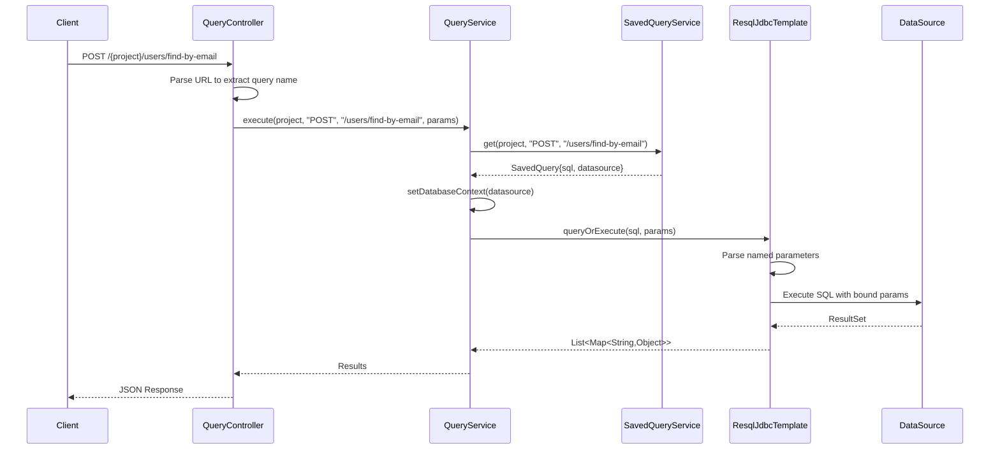

# Architecture Overview

## System Design

Resql is a Spring Boot microservice that bridges the gap between SQL files and REST APIs. The core principle is simplicity: drop a `.sql` file in a directory, and it becomes a callable REST endpoint.

## High-Level Architecture



## Core Components

### 1. QueryController
**Location:** `src/main/java/rig/sqlms/controller/QueryController.java`

Entry point for all REST requests. Maps HTTP endpoints to SQL queries.

**Responsibilities:**
- Parse incoming HTTP requests (GET/POST)
- Extract query name from URL path
- Route to QueryService with parameters

**Endpoint Pattern:**
```
POST /{project}/{path-to-query}
GET /{project}/{path-to-query}
POST /{project}/{query}/batch
```

### 2. QueryService
**Location:** `src/main/java/rig/sqlms/service/QueryService.java`

Business logic layer that orchestrates query execution.

**Responsibilities:**
- Load saved SQL queries by name
- Set datasource context for routing
- Execute queries with parameter binding
- Return results as JSON-compatible maps

### 3. SavedQueryService
**Location:** `src/main/java/rig/sqlms/service/SavedQueryService.java`

Manages loading and caching of SQL files.

**Responsibilities:**
- Scan configured directories for `.sql` files
- Parse query metadata from file headers
- Cache queries in memory
- Map file paths to endpoint names

**File Naming Convention:**
```
sql/{project}/{method}/{query-name}.sql
→ Becomes: /{project}/{query-name}
```

### 4. RoutingDataSource
**Location:** `src/main/java/rig/sqlms/datasource/RoutingDataSource.java`

Dynamic datasource routing based on thread-local context.

**Responsibilities:**
- Route queries to correct database
- Support multiple datasource configurations
- Enable multi-tenancy patterns

### 5. ResqlJdbcTemplate
**Location:** `src/main/java/rig/sqlms/datasource/ResqlJdbcTemplate.java`

Custom JDBC template with named parameter support.

**Responsibilities:**
- Parse `:paramName` syntax in SQL
- Bind JSON parameters to SQL placeholders
- Execute queries and map results
- Handle both SELECT and DML statements

## Configuration Components

### DataSourceConfiguration
**Location:** `src/main/java/rig/sqlms/datasource/DataSourceConfiguration.java`

Spring configuration for datasource beans.

**Features:**
- Multiple datasource support
- Connection pool management
- Transaction management
- Health check configuration

### SecurityConfiguration
**Location:** `src/main/java/rig/sqlms/config/SecurityConfiguration.java`

Spring Security setup.

**Default Behavior:**
- All endpoints require authentication (customizable)
- HTTP Basic Auth support
- CORS configuration
- CSRF protection

## Data Flow

### Request Processing Flow



## Technology Stack

### Core Framework
- **Spring Boot 3.2.5** - Application framework
- **Spring Web** - REST API support
- **Spring JDBC** - Database access
- **Spring Security** - Authentication/Authorization

### Database Support
- **PostgreSQL** - Primary production database
- **H2** - Embedded database for testing

### Observability
- **OpenTelemetry** - Distributed tracing
- **Slf4j/Logback** - Logging
- **Spring Actuator** - Health checks

### API Documentation
- **SpringDoc OpenAPI** - Swagger UI
- **OpenAPI 3.0** - API specification

### Build & Runtime
- **Maven** - Build tool
- **Java 17** - Runtime
- **Lombok** - Code generation
- **Docker** - Containerization

## Design Principles

### 1. Convention over Configuration
SQL file paths directly map to REST endpoints without additional configuration.

### 2. Simplicity First
Minimal code required to expose a database query as an API.

### 3. Multi-tenancy Ready
Datasource routing enables serving multiple databases from one instance.

### 4. Security by Default
All endpoints protected unless explicitly configured otherwise.

### 5. Observable
Built-in support for distributed tracing and structured logging.

## Extension Points

### Custom Query Processors
Extend `ResqlJdbcTemplate` for custom SQL parsing logic.

### Authentication Providers
Configure Spring Security for OAuth2, JWT, or custom auth.

### Query Interceptors
Add filters or aspects to modify queries before execution.

### Result Transformers
Post-process query results before returning to client.

## Performance Considerations

### Query Caching
- SQL files loaded once at startup
- In-memory cache for query metadata
- Reload mechanism for development

### Connection Pooling
- HikariCP for production datasources
- Configurable pool sizes
- Connection leak detection

### Thread Safety
- ThreadLocal for datasource context
- Stateless services
- Immutable query objects

## Security Model

### Authentication
- Pluggable Spring Security configuration
- Support for multiple auth methods
- Token-based auth ready

### SQL Injection Prevention
- Named parameters only
- No string concatenation
- Prepared statements

### Access Control
- Endpoint-level security rules
- Query-level permissions (future)
- Datasource isolation

## Deployment Architecture

### Standalone Mode
Single WAR file deployable to any servlet container.

### Docker Container
Containerized deployment with environment-based configuration.

### Kubernetes Ready
Health checks, graceful shutdown, and 12-factor app compliance.
